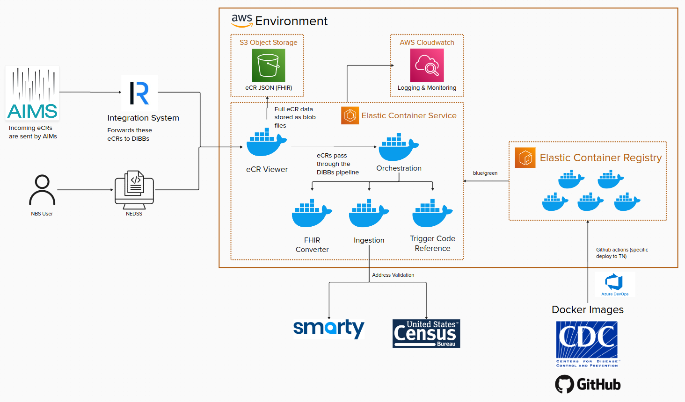

# Table of Contents
- [Table of Contents](#table-of-contents)
  - [Architectural Design](#architectural-design)
  - [Requirements](#requirements)
  - [Terraform documentation](#terraform-documentation)
  - [Before You Begin](#before-you-begin)
  - [Quick Start](#quick-start)
  - [Helper Scripts](#helper-scripts)
  - [Secrets Management](#secrets-management)
    - [Options for Secrets Management](#options-for-secrets-management)
      - [Option 1: AWS Secrets Manager](#option-1-aws-secrets-manager)
      - [Option 2: GitHub Secrets](#option-2-github-secrets)
      - [Option 3: Direct Variable Injection](#option-3-direct-variable-injection)
  - [Common Issues and Solutions](#common-issues-and-solutions)
  - [Modules used in this repository](#modules-used-in-this-repository)
  - [Development Workflow](#development-workflow)

## Architectural Design

The current architectural design for dibbs-aws is as follows:



---

- [Return to Table of Contents](#table-of-contents)

---

## Requirements

This section will assist engineers with executing Infrastructure as Code (IaC) found in the _dibbs-aws_ repository utilizing Terraform.  

**Engineers will need following tools installed on their local machine:**
* Terraform version 1.0.0+  [Hashicorp installation Guide](https://developer.hashicorp.com/terraform/tutorials/aws-get-started/install-cli)
* AWS CLI version 2+ [AWS CLI Installation Guide](https://docs.aws.amazon.com/cli/v1/userguide/cli-chap-install.html)
* AWS Profile Access

_**Note**_: Engineers *must* have access and permissions to create AWS resources

---

- [Return to Table of Contents](#table-of-contents)

---

## Terraform documentation
If you have not used terraform before, and have the will to learn, please visit these resources before continuing.

- Terraform Documentation: The official Terraform documentation is an exhaustive resource that covers everything from installation to advanced topics. https://developer.hashicorp.com/terraform/docs
- Terraform/AWS Intro: HashiCorp provides an official tutorial that covers the basics of Terraform and helps you get started with deploying infrastructure into AWS. https://developer.hashicorp.com/terraform/tutorials/aws-get-started
- Terraform AWS Provider Documentation: If you're using Terraform with AWS, this documentation provides detailed information on the available resources and data sources. https://registry.terraform.io/providers/hashicorp/aws/latest/docs
- Terraform module (git source): The ECS module is sourced directly from the [terraform-aws-dibbs-ecr-viewer repository](https://github.com/CDCgov/terraform-aws-dibbs-ecr-viewer). See the [ECS module README](terraform/implementation/ecs/README.md) for details on current module sources.

---

- [Return to Table of Contents](#table-of-contents)

---

## Before You Begin

Ensure you have the following prerequisites before deploying:

- **AWS Account** with permissions for IAM, VPC, ECS, RDS, S3, DynamoDB, ACM, and Route 53
- **Terraform** version 1.0.0+ installed locally
- **AWS CLI** version 2+ configured with appropriate credentials
- **GitHub repository** (for OIDC configuration if using CI/CD)
- **SSL certificate** in AWS Certificate Manager (ACM) for your domain
- **Route 53 hosted zone ID** (if using a custom domain)
- For non-integrated auth: OAuth application credentials from your provider

---

- [Return to Table of Contents](#table-of-contents)

---

## Quick Start

Get started deploying this infrastructure (See helper scripts and secrets management):

```bash
# Clone the repository
git clone https://github.com/CDCgov/dibbs-aws.git
cd dibbs-aws

# Step 1: Set up your AWS backend - See Helper Scripts
cd terraform/implementation/setup
./setup.sh

# Step 2: Configure and deploy ECS
cd ../ecs
cp -r . ../my-environment  # Optional: create environment-specific copy
cd ../my-environment
./deploy.sh -e dev
```

For detailed step-by-step instructions, see [Helper Scripts](#helper-scripts).

---

- [Return to Table of Contents](#table-of-contents)

---

## Helper Scripts

**If you are familiar with terraform, have setup a backend, understand terraform deployment workflows, know how to validate terraform, or are otherwise opinionated about how you want to run things, feel free to skip this section**
- We have several helper scripts that will assist you with setting up your AWS backend and deploying your AWS resources.
- These scripts are located in the **terraform/utilities** folder, the **terraform/implementation/setup** folder and the **terraform/implementation/ecs** folder.

| Folder | Purpose |
|--------|---------|
| `terraform/utilities` | Scripts for generating terraform docs, formatting and linting code |
| `terraform/implementation/setup` | Creates the terraform backend (S3 state bucket, DynamoDB lock table) and OIDC configuration |
| `terraform/implementation/ecs` | Deploys the ECS module (eCR Viewer application infrastructure) |

- The **setup.sh** script creates the terraform state backend and .env files. It also sets up OIDC for GitHub workflows.
- The **deploy.sh** script deploys your ECS module from your development machine.

**Note**: It is not recommended to run these scripts without reviewing them and understanding their limitations.

**Helper Scripts vs CI/CD:**
- Use helper scripts (`./setup.sh`, `./deploy.sh`) for local development, testing, and interactive deployments from your machine
- Use GitHub workflows (see [examples](https://github.com/CDCgov/dibbs-aws/tree/main/.github/workflows)) for automated CI/CD deployment to production environments

**Terraform validation and docs with `./utils.sh`**
* In your terminal, navigate to the _/terraform/utilities_ folder.
* `cd /terraform/utilities`
* Run `./tfdocs.sh` to generate terraform documentation.
* Run `./tffmt.sh` to validate your terraform code.
* Run `./tflint.sh` to lint your terraform code.
* Run `./utils.sh` to run all utilities.

**Update And Setup Your AWS Backend with `./setup.sh`**
* In your terminal, navigate to the _/terraform/implementation/setup_ folder.
* `cd /terraform/implementation/setup`  
* Run `./setup.sh`

**Note**: You will be prompted to set your variable values (i.e. *Region*, *Owner*, *Project*, etc.).  For example, the default value for *Owner* is `Skylight`. You can change this value to one that represents your organization or department. Keep these short and sweet to prevent running into character limits when provisioning AWS resources. _The Owner name <u>must</u> be <u>less than</u> 13 characters_.

The `setup.sh` scripts will assist you with creating the terraform state and tfvars files, as well as check to ensure the necessary arguments or variables were created.  See [setup.sh](https://github.com/CDCgov/dibbs-aws/blob/main/terraform/implementation/setup/setup.sh) file.  Also see [Inputs](https://github.com/CDCgov/dibbs-aws/blob/main/terraform/implementation/setup/README.md#inputs).

The setup.sh script will create the following files:

- _tfstate.tfvars_ - Terraform variables for the state backend configuration
- _.env_ - Environment variables used by deployment scripts
- _terraform.state_ - Local terraform state file (if using local backend)

**Deploy Your ECS Module with `./deploy.sh`**

- It is highly recommended to create a new directory per environment that is launched. To do so, run:
```bash
cp -r terraform/implementation/ecs terraform/implementation/<ENVIRONMENT_NAME>
```
The benefits of doing this reduce the likelihood of conflicts and allow each environment to run different versions of the same module.

To deploy your ECS Module from your local machine:

- Navigate to your working directory:
```bash
cd terraform/implementation/ecs/
# or for a custom environment:
cd terraform/implementation/<ENVIRONMENT_NAME>
```

- Run the deploy script for your designated environment:
```bash
./deploy.sh -e <ENVIRONMENT>
```

_**Note**_: The `-e` flag specifies the environment (e.g., `dev`, `test`, `prod`). This can match your `<ENVIRONMENT_NAME>` directory naming convention, or be any environment name your team desires.

For non-interactive deployments, ensure you have a `.env` file with the required variables before running deploy.sh. See the [setup.sh](https://github.com/CDCgov/dibbs-aws/blob/main/terraform/implementation/setup/setup.sh) script for the expected format.

---

- [Return to Table of Contents](#table-of-contents)

---

## Secrets Management

When adopting this repository, you have multiple options for storing and managing secrets. This document outlines possible approaches and how they integrate with the infrastructure.

---

### Options for Secrets Management

#### Option 1: AWS Secrets Manager

AWS Secrets Manager is integrated into the Terraform code and provides secure storage for sensitive values within AWS. Secrets can be accessed by ECS tasks, Lambda functions, and other AWS services via IAM roles.

**Use this approach if:**
- You want built-in secret rotation capabilities
- You prefer centralized secrets management through AWS

**How it works:**

The database module automatically creates Secrets Manager resources for connection strings and can be used as an example, even if you don't plan to use this module:

```hcl
# From terraform/modules/db/postgresql.tf
resource "aws_secretsmanager_secret" "postgresql_connection_string" {
  name        = "${local.vpc_name}-postgresql-connection-string-${random_string.secret_ident[0].result}"
  description = "Postgresql connection string for the ecr-viewer"
}

resource "aws_secretsmanager_secret_version" "postgresql" {
  secret_id     = aws_secretsmanager_secret.postgresql_connection_string[0].id
  secret_string = "postgres://${aws_db_instance.postgresql[0].username}:${random_password.database.result}@${aws_db_instance.postgresql[0].address}:${aws_db_instance.postgresql[0].port}/${aws_db_instance.postgresql[0].db_name}"
}
```

**To use with your deployment:**

```hcl
# Reference the database connection string secret from the module
module "db" {
  source = "../../modules/db"
  # ... other configuration ...
}

# Example: Create auth secrets directly in your deployment
resource "aws_secretsmanager_secret" "auth_secret" {
  name        = "auth_secret"
  description = "auth secret string for the ecr-viewer"
  tags        = var.tags
}

resource "aws_secretsmanager_secret_version" "auth_secret" {
  secret_id     = aws_secretsmanager_secret.auth_secret.id
  secret_string = var.auth_secret
}

module "ecs" {
  source  = "CDCgov/dibbs-ecr-viewer/aws"
  version = "1.0.0"

  # Use the database connection string secret from the db module
  secrets_manager_connection_string_version = module.db.secrets_manager_database_connection_string_version

  # For auth secrets, create your own Secrets Manager resources and reference them directly:
  secrets_manager_auth_secret_version       = aws_secretsmanager_secret_version.auth_secret.secret_string
}

```

---

#### Option 2: GitHub Secrets

GitHub Secrets store sensitive values in your GitHub repository and can be injected into CI/CD workflows as environment variables.

**Use this approach if:**
- You want to keep secrets within GitHub without AWS dependencies
- Your workflow needs authentication provider credentials (OAuth, AD, Keycloak)
- You prefer secrets management through GitHub's UI

**How it works:**

Configure secrets in your GitHub repository under **Settings > Secrets and variables > Actions**, then reference them in workflows:

```yaml
# .github/workflows/deployment_apply.yaml
- name: Set auth secrets for AD
  if: ${{ inputs.dibbs-ecr-viewer-auth-provider == 'ad' }}
  run: |
    echo "AUTH_CLIENT_ID=${{ secrets.AD_AUTH_CLIENT_ID }}" >> $GITHUB_ENV
    echo "AUTH_ISSUER=${{ secrets.AD_AUTH_ISSUER }}" >> $GITHUB_ENV
    echo "AUTH_SECRET=${{ secrets.AD_AUTH_SECRET }}" >> $GITHUB_ENV

- name: Terraform
  env:
    BUCKET: ${{ secrets.TFSTATE_BUCKET }}
    DYNAMODB_TABLE: ${{ secrets.TFSTATE_DYNAMODB_TABLE }}
  shell: bash
  run: |
    # Secrets are available as environment variables
```

**Common secrets to configure:**

| Secret Name | Description |
|-------------|-------------|
| `AWS_ROLE_ARN` | IAM role ARN for deployments via OIDC |
| `TFSTATE_BUCKET` | S3 bucket name for Terraform state |
| `TFSTATE_DYNAMODB_TABLE` | DynamoDB table for state locking |
| `ROUTE53_HOSTED_ZONE_ID` | Route 53 hosted zone ID |
| `AD_AUTH_*` or `KEYCLOAK_AUTH_*` | Authentication provider credentials |

---

#### Option 3: Direct Variable Injection

You can also pass secrets directly as Terraform variables (not recommended for production).

**Example tfvars file:**

```hcl
# secrets.tfvars (keep this file out of version control)
auth_client_id                        = "your-client-id"
auth_issuer                           = "https://example.com"
auth_secret                           = "your-auth-secret"
auth_client_secret                    = "your-client-secret"
secrets_manager_auth_secret_version   = "arn:aws:secretsmanager:..."
```

---

- [Return to Table of Contents](#table-of-contents)

---

## Common Issues and Solutions

| Issue | Solution |
|-------|----------|
| OIDC token errors | Verify your GitHub repository name matches exactly (format: `org/repo`) and the OIDC role trust policy is configured correctly |
| Permission denied on scripts | Run `chmod +x terraform/implementation/setup/setup.sh` and `chmod +x terraform/implementation/ecs/deploy.sh` |
| State lock error | Wait for any existing Terraform operations to complete, or remove the `.terraform.lock.hcl` file if stale |

---

- [Return to Table of Contents](#table-of-contents)

---

## Modules used in this repository

**Remote sources:**
- [terraform-aws-dibbs-ecr-viewer](https://github.com/CDCgov/terraform-aws-dibbs-ecr-viewer) - This module deploys the eCR Viewer application to AWS. See the [ECS module README](terraform/implementation/ecs/README.md) for detailed configuration options.
- [terraform-aws-modules/vpc/aws](https://registry.terraform.io/modules/terraform-aws-modules/vpc/aws/latest) - This module provisions the VPC infrastructure for the ECS module.

**Local modules:**
- [oidc](terraform/modules/oidc/README.md) - OIDC module, used to setup OIDC for GitHub workflows
- [tfstate](terraform/modules/tfstate/README.md) - TFState module, used to setup the terraform state backend and lock table
- [db](terraform/modules/db/README.md) - Database module, used to setup the database for the ECS module

---

- [Return to Table of Contents](#table-of-contents)

---

## Development Workflow

**Use the dibbs-aws repository**

1. Select to create your own repo from this template, or fork it to your own repository.
2. Clone the repository to your local machine.
3. Make a new branch for your changes: `git checkout -b <BRANCH>`.
4. Make any changes required by your team to the terraform configurations.
5. Add and commit changes to your working branch: `git add . && git commit -m "Your message here"`.
6. Push your changes to your github repository: `git push origin <BRANCH>`.
7. Open a Pull Request so that your team can review your changes and testing can be done.
8. Go back to step 4 until your changes are approved.
9. Once your changes are approved, merge your changes into the main branch.

**Terraform Commands**

For help with terraform commands, please visit the [official Terraform documentation](https://developer.hashicorp.com/terraform/tutorials/aws-get-started).

---

- [Return to Table of Contents](#table-of-contents)

---
